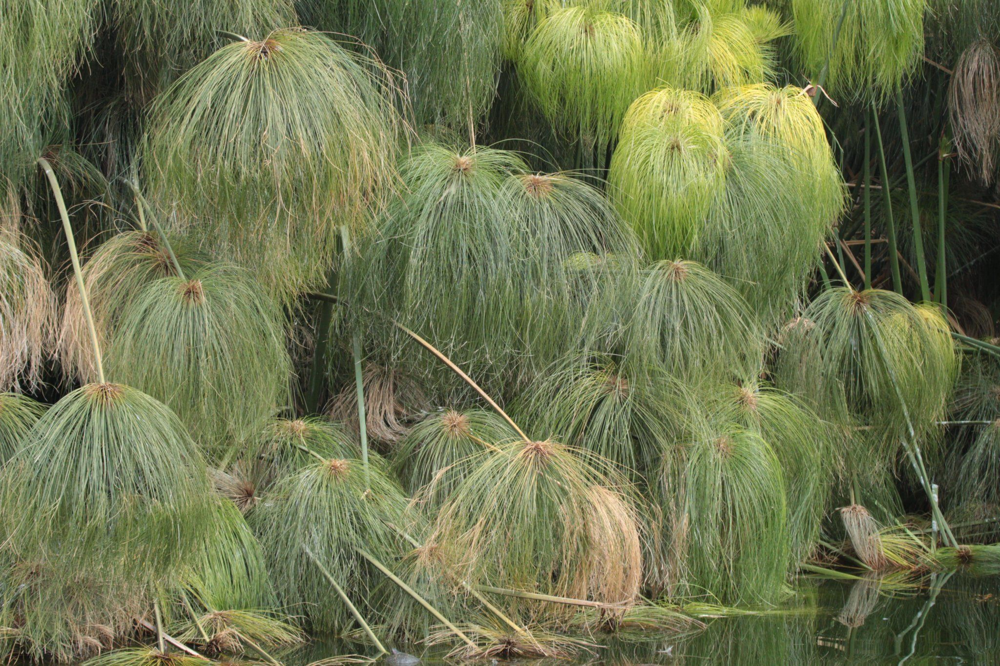

ifdef::backend-html5[]
.Egyptian paperplant (_Cyperus papyrus_), Chapultepec, Mexico City. Photo 2016 Alfonso Gutiérrez Aldana via https://www.gbif.org/occurrence/1265538197[iNaturalist Research-grade Observations] licensed under http://creativecommons.org/licenses/by-nc/4.0/[CC BY-NC 4.0].

endif::backend-html5[]

== Colophon

=== Suggested citation

GBIF Secretariat (2020) GBIF Documentation Guidelines. Copenhagen: GBIF Secretariat. https://doi.org/10.35035/doc-5xs6-hm38.

=== Contributors

https://orcid.org/0000-0002-1920-5298[Laura Russell], https://orcid.org/0000-0003-0623-6682[Matthew Blissett] & https://orcid.org/0000-0002-6590-599X[Kyle Copas]

=== Licence

The document _GBIF Documentation Guidelines_ is licensed under https://creativecommons.org/licenses/by-sa/4.0[Creative Commons Attribution-ShareAlike 4.0 Unported License].

=== Persistent URI

https://doi.org/10.35035/doc-5xs6-hm38

=== Document control

Updated July 2020

=== Cover image

// Caption. Credit, source, licence.
Egyptian paperplant (_Cyperus papyrus_), Chapultepec, Mexico City. Photo 2016 Alfonso Gutiérrez Aldana via https://www.gbif.org/occurrence/1265538197[iNaturalist Research-grade Observations] licensed under http://creativecommons.org/licenses/by-nc/4.0/[CC BY-NC 4.0].
