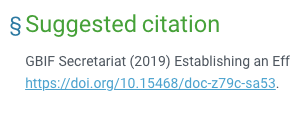

= GBIF Documentation Guidelines
GBIF Secretariat <communication@gbif.org>
:revnumber: {git-metadata-branch}
:revdate: {git-metadata-date} {git-metadata-time} {git-metadata-timezone}
:title-logo-image: 1265538197-Cyperus-papyrus.jpg
:license: https://creativecommons.org/licenses/by/4.0/

ifdef::backend-html5[]
.https://www.gbif.org/occurrence/1265538197[_Cyperus papyrus_ L.], observed in Mexico by Alfonso Gutiérrez Aldana.  Photo (via iNaturalist) licensed under http://creativecommons.org/licenses/by-nc/4.0/[CC BY-NC 4.0].
image::1265538197-Cyperus-papyrus.jpg[Photograph of _Cyperus papyrus_ L.]
endif::backend-html5[]

ifdef::backend-html5[]
_languageLinks:pdf[This document is also available in,PDF format]._
endif::backend-html5[]

[preface]
== Background

ifdef::backend-pdf[]
Cover image: https://www.gbif.org/occurrence/1265538197[_Cyperus papyrus_ L.], observed in Mexico by Alfonso Gutiérrez Aldana.  Photo (via iNaturalist) licensed under http://creativecommons.org/licenses/by-nc/4.0/[CC BY-NC 4.0].
endif::backend-pdf[]

GBIF—the Global Biodiversity Information Facility—has long produced technical documentation on a range of topics relating to biodiversity informatics and open biodiversity data with the aim of supporting a global community of practice. 

The GBIF Secretariat is now seeking to clarify its coordination role in developing such documentation while engaging its community to collaborate with subject-matter experts commissioned to create and update under the guidance of an editorial panel. This goal of this approach is to provide uniform, reliable, reusable, versioned, and easily updatable materials that instill community trust in the available documentation and foster its use. 

The key features of this system will include

* Standardized documentation
* Routine updates, versioning and translations
* Community input 
* Peer review
* Searchable format

== The Editorial Panel

The Editorial Panel (EP) consists of a volunteer group of experts that, in coordination with GBIF Secretariat staff, will provide oversight, guidance and peer-review of the GBIF documentation. The EP will provide recommendations to the GBIF Secretariat on commissioning high-priority guidance from subject-matter experts, with the following responsibilities:

.Prioritize needs both for updating/revising existing documentation and for generating new documentation.
.Establish review process (how reviews will happen, how many members are required for review, timeline, etc.).
.Make recommendations regarding the documentation system (via GitHub repositories) for future sustainability.
.Review drafts and provide comments back to authors.

=== Operations

Each year, the EP will review available documentation and identify priority candidates for updates. and will review and approve updated documentation for publication. The EP should consult widely with other experts, institutions, initiatives andprojects within the biodiversity informatics community at-large when considering updates to and for new documentation.

=== Annual process

. Annually, the EP shall prioritize documentation needs and make recommendations for calls for documentation when appropriate.
. Calls will issued by GBIFS to the community when appropriate.
. EP will review and make recommendations on documentation proposals.
. GBIFS will draw and issue contract with authors/teams of experts.
. Authors will compile first draft drawing on community input when appropriate and submit to EP.
. EP will review drafts and provide comments back to authors.
. Authors will revise drafts based on EP’s review.
. Versions will be released publicly and openly.
. GBIFS will complete and issue derived products (translations, training modules, etc.).

== Guidelines for document authors

Unlike a word processor like _Microsoft Word_, GBIF's documentation is stored in plain text files.  This means

* Authors need not worry about maintaining a consistent style,
* Changes to the document can be tracked and managed using general tools,
* The same source files can produce multiple outputs automatically, such as HTML and PDF,
* Document translations can be tracked.

Of course, that does mean learning about some different tools — but the ones we have chosen are widely used in the publishing, software development and translation communities.

=== Writing in AsciiDoctor
AsciiDoctor is a text document format for writing (among other things) books, ebooks, and documentation. It is similar to wiki markup — if you can write a Wikipedia article, then you’ll have no problem with AsciiDoctor.

.AsciiDoctor User Guide
[TIP]
====
The https://asciidoctor.org/docs/user-manual/[AsciiDoctor User Guide] provides an excellent reference to what's possible with AsciiDoctor.
====

Here are the most common parts of AsciiDoctor markup:

==== Text
Regular paragraph text does not need any special markup in AsciiDoctor. Just add a blank line both above and below each paragraph, and the first word in the paragraph should not have a space before it. Here are some example paragraphs in AsciiDoctor:

----
This is an example paragraph written in AsciiDoctor. See, it's just plain text; no special markup necessary! Do make sure there aren't spaces or manual indentations at the beginning of your paragraph text.

This is a second example paragraph in AsciiDoctor. Note that there's a line break and a blank line between paragraphs.
----

[[chapters]]
==== Chapters and headings
The top of each chapter file should begin with a chapter title preceded by two equals signs. It's good practice to always include a unique ID string above the chapter title, surrounded in double brackets, for example:

----
[[unique_chapter_id]]
== Chapter Title

Chapter text begins here.
----

The unique ID string is used to link directly to a chapter or section, such as <<chapters,this link to this section>>.  Readers can also link directly to a section, by using the § link that appears when the mouse hovers over a chapter heading.

===== Top-level heading
Within a chapter, the first and highest heading level uses three equals signs:

----
=== Top-Level Heading
----

Lower-level headings continue with additional `=` signs.

_https://asciidoctor.org/docs/user-manual/#sections[Continue reading about section headings in the AsciiDoctor User Guide]._

==== Inline Markup
Here are some standard typographical conventions with explanations of how they're commonly used:

`+_Italic_+` One underscore character on either side of text marks it as _italics_ in AsciiDoctor.

`+*Bold*+` *Bolded text* is used to emphasize a word or phrase. The AsciiDoctor markup is one asterisk on either side of the text to be bolded.

`pass:[`Constant Width`]`
Constant width, or `monospaced`, text is used for code, as well as within paragraphs to refer to program elements such as variable or function names, databases, data types, environment variables, statements, and keywords. The AsciiDoctor markup is one grave accent sign on either side of the text to monospaced.

Hyperlinks:
For hyperlinks to external sources, just add the full URL string followed by brackets containing the text you'd like to appear with the URL. The bracketed text will become a clickable link in web versions. In print versions, it will appear in the text, followed by the actual URL in parenthesis.

The markup looks like this:

----
Visit https://www.gbif.org/[GBIF.org].
----

_https://asciidoctor.org/docs/user-manual/#text-formatting[Continue reading about text formatting in the AsciiDoctor User Guide]._

==== Admonitions
AsciiDoctor allows authors to call out supplemental admonitions in the form of notes, tips, warnings and cautions.

For a note, the markup looks like this:

----
[NOTE]
====
Past trends are no guarantee of future performance.
====
----

And here’s how it renders:

[NOTE]
====
Past trends are no guarantee of future performance.
====

There is also a short form, which is appropriate for a single sentance:

----
NOTE: Past trends are no guarantee of future performance
----

_https://asciidoctor.org/docs/user-manual/#admonition[Continue reading about admonitions and other block formatting in the AsciiDoctor User Guide]._  The guide also covers other formatting, such as bulleted or numbered lists, tables and images.

=== Structuring the document

All documents whose primary language is English start from the file `index.en.adoc`.  Using the https://asciidoctor.org/docs/user-manual/#include-directive[`include` directive] allows a single document to be spread across multiple files.  This makes editing (especially collaborative editing) easier, helps translators, and simplifies reordering sections of a document.  

Except for the primary file being called `index.en.adoc`, there are no hard restrictions on how a document must be structured.  It is probably easiest for editors to structure documents with number-prefixed filenames, preferably with large intervals to allow new sections to be inserted.

----
├── index.en.adoc
├── 100.en.adoc
├── 200.en.adoc
├── 250.en.adoc <1>
├── 300.en.adoc
└── 400.en.adoc
----
<1> This file was presumably added later, between `200` and `300`.

See the section on <<translation,translating documents>> when adding, changing or deleting document files.

[[source_code]]
=== Document “source code”

The plain text files and other assets (images, data tables) that form each document comprises the _source code_.

These source files are stored in a _Git repository_, which (for GBIF) is managed by a commercial service, _GitHub_.

The source code for this document is stored at https://github.com/gbif/doc-documentation-guidelines/, the source code for this part of the document can be seen https://raw.githubusercontent.com/gbif/doc-documentation-guidelines/master/index.en.adoc[here].

Contributors can edit the source code either in a web browser using the GitHub interface or on a computer (including when offline) using Git. They may also submit https://github.com/gbif/doc-documentation-guidelines/issues[issues] that comment or flag problems for others to address, including outdated information, broken links, misspellings and the like.

NOTE: Many tutorials for using both Git and Github are available on the web.

=== Document versions

Some documents are published as multiple versions.  This is done using _branches_ in Git: the name of the branch, such as `1.0` or `2019`, is the identifier for the version.  This allows for edits to old versions, such as updating a link or correcting a syntax error in the document.

// For multi-version projects, Jenkins is set to build from every branch, and deploy to a subdirectory on the webserver.

=== Generating the document

The source `.adoc` files in the repository are converted into the finished HTML and PDF documents using the _AsciiDoctor_ tool.  Every time a change is made to the repository, the https://builds.gbif.org/[GBIF build server] is notified.  It retrieves the document source code, generates the document (in HTML and PDF, and in all available languages), then copies the formatted documents to a webserver.

A log file of recent builds is kept by the build server.  If there is a syntax error preventing the document from being generated, you may need to inspect the log file to see what the problem is.

=== Local document build

If you are familiar with software development tools you can build a document on your own computer — this is useful for previewing changes.  You will first need to setup https://www.docker.com/[Docker].  Then, open a terminal window and navigate using the `cd` command to the top-level directory of your documen — for this document, it would be `doc-documentation-guidelines`.  You can then build the HTML document with this command:

`+docker run --rm -it --user $(id -u):$(id -g) -v $PWD:/documents/ gbif/asciidoctor-toolkit+`

Assuming all is well, the resulting documents are in subdirectories coded by language (such as `en`), including both HTML and PDF files.  The output from the command should provide clues if there are problems.

[[issues_pull_requests]]
=== Handling issues and pull requests

*_This section has not been written._*

=== Publishing a document

Here, publishing a document means building the document for `*docs.gbif.org*`, rather than the test system `*docs.gbif-uat.org*`.

TODO: Document the process, which is done by making a release from GitHub, but currently needs some care to ensure the build system (Jenkins) is configured correctly.

=== Who to ask for help

*_This section has not been written. Ask Kyle or Matt, or create an issue._*

[[translation]]
== Guidelines for translating documents

Documents to be translated need some set-up.

The translation system uses `.po` "_Portable Object_" files, which are commonly used for translating software and websites.

// TODO: change the example to point to the template, which doesn't yet have this file.
. A file `po4a.conf` needs to exist, as in https://github.com/gbif/doc-gbif-communications-strategy/blob/1.0/po4a.conf[this example].  Each `*.en.adoc` file needs an entry in `po4a.conf`:
+
`+[type:asciidoc] 100.en.adoc $lang:100.$lang.adoc+`

. The build server will create (or update) the translation template file `translations/index.pot` with the source (English) text.  It does this every time a build runs.
. The document should be setup on Crowdin.  [TODO – how?]  This generates a file `crowdin.yml`.
. As translators add translations to the text, Crowdin will make a <<issues_pull_requests,pull request>> on the repository.  This should be merged.
. The build server will then rebuild the document.

[sidebar]
.Alternatives to Crowdin
--
It is also possible to translate documents without Crowdin, using desktop tools instead.  The translators then need to use Git/GitHub.  These additional steps are needed:

. For a new language, copy the generated `index.pot` (_Portable Object Template_) file to the new file `xx.po`, where `xx` is the https://en.wikipedia.org/wiki/List_of_ISO_639-1_codes[language code].  For example this would be `da.po` for a Danish translation.
. To update a translation, open the `xx.po` file in a po-file editor and choose the option to "Update from POT file" or similar.
. Use a po-file editor to make the translations.  Examples are https://poedit.net/[Poedit] (software) or https://localise.biz/free/poeditor[poeditor] (website).
. Use Git/GitHub to replace the old translation file with your updated translation file.
. Push the changes, and the build server will rebuild the document

*It is not recommended to use both methods on the same document.  If translations conflict they would not be lost, but the resulting mess can be confusing to sort out using Git.*
--

== Community peer-review process

Community peer-review is just a single step in GBIF's digital documentation workflow, but it provides an important opportunity for members of the GBIF community of practice—the intended users and beneficiaries of these documents—to guide their development by offering direct input and feedback. While this process is first and foremost intended to ensure the quality of the documentation, it can also serve as a mechanism for fostering community discussion and collaboration.

The process starts from the premise that authors and reviewers are part of the same community. The fact that their identities are not concealed at any point during the process, reviewers and authors should be encouraged toward open, honest and collegial exchanges, with a focus on constructive criticism even where difference of opinion exist. The focus of reviewers should be to support authors in improving their work to the benefit of the broader biodiversity informatics community. All community members are responsible for ensuring that their own actions encourage a "safe, hospitable, and productive environment" that is "professional, respectful and harrassment-free for all participating," in adherence with the https://www.gbif.org/code-of-conduct[GBIF Code of Conduct].

Each document's source text is freely and openly available and maintained in a public GitHub repository, or "repo". The use of GitHub enables reviewers and users to raise issues and track their resolution. Reviewers and users can offer comments, suggestions and corrections at any stage of the document's life cycle, making it easier to make corrections to current versions and update future ones while ensuring community access to accurate, well-maintained guidance and information.

Staff from the GBIF Secretariat commits to two operational principles to ensure the transparency and effectiveness of the community review process:
. Individual contributions by community members will be properly credited and acknowledged
. Open issues will be resolved in timely fashion, whether by the authors or by Secretariat staff

=== Best practices for community peer reviewers

* Recognizing that members of our community are all extremely busy, if you intend to provide comments during the community peer-review process, set aside sufficient time to read and digest the document (the PDF version of each document offers a convenient tool for this purpose). 
* Use a first read to form a general impression of the document, noting any major problems or concerns.
* Keeping your notes handy, begin a second read-through in which you flag possible issues point-by-point. 
* Comment on the validity of the guidance provided in the documentation, identifying possible errors and evaluating the approaches
* Identify any references, citations, precedents or examples that you feel may be missing or mischaracterized 

=== How to submit your review comments and suggestions

* If you have not already done so, https://github.com/[*sign up for a GitHub account*]. Again, to encourage transparency, choose a username that allows others in the community to identify and recognize you with relative ease.    
* *Find the GitHub repository for the document under review*. The HTML version of any document provides a link to "Edit on GitHub" and its source repository near the top of its tree navigation. Reviewers can also search for the repository through the https://github.com/gbif[GBIF GitHub organization page]. Searches can be more efficient knowing that the names of the repositories for GBIF's digital documentation all begin with the prefix /doc-/, followed by a shortened, plain-language version of the title.  
* *Submit your comments as issues in the document's GitHub repository*. The 'Issues' tab is second from the left in every repository. 
* Where possible, *group similar comments in a single issue*. For example, reviewers who identify (heaven forbid!) multiple spelling or punctuation errors should consider submitting such items in a single issue. Then, when commenting on content or offering other suggestions, the same reviewer should include those in a second issue. 
* *Use deep links to document sections*. Reviewers can link to any section heading in any document, thereby providing an accurate citation of where the issue or problem you wish to identify arises.  Mousing over the left end of the heading will cause the appearance of a section symbol—*§*—which users can then right-click or option-click to copy a direct link to that location in the document. The link available by right- or option-clicking the section symbol in the example pictured below, for example, is 
....
https://docs.gbif.org/effective-nodes-guidance/1.0/en/#_suggested_citation 
.... 

* *Track the progress and resolution of your issues*. We encourage you to sign up for notifications of actions that others take in connection with the issues you submit. Doing so may permit direct, reciprocal discussion between authors and reviewers, as and where appropriate. 

== 'Decommissioning' old documents

As a matter of practice, the Secretariat will 'decommission' and remove earlier versions of documents from GBIF through the following series of steps:

. Register a GBIF DOI via DataCite for the previous version of the document (provided that one does not already exist)
. Produce an archival standard version (PDF/A) of the document—or documents, if translations are available
. Deposit the file(s) in Zenodo with the assigned DOI
. Update the DataCite metadata to resolve the DOI to the new Zenodo deposit
. Include a reference to the earlier version in the current document's metadata on GBIF.org (e.g. https://www.gbif.org/document/80925)

This approach achieves several key goals:
* Previous versions will be permanently discoverable using a persistent identifier
* GBIF will no longer have to manage either the old file or its URL (or, as is more often the case, URLs, plural) 
* Users searching on GBIF.org will retrieve only the current documents, which then reference older versions 

== Guidelines for software developers

NOTE: This section is technical information for GBIF software developers maintaining the system that powers these documents.

The documents combine several small Linux tools:

* Git, for source control,
* https://asciidoctor.org/[AsciiDoctor], chosen with essentially the same reasoning as https://github.com/KiCad/kicad-doc/blob/5.1.0/doc_alternatives/README.adoc[the KiCad documentation authors] (and following their approach to translation),
* https://po4a.org/[po4a], for translations,
* https://builds.gbif.org/[GBIF's Jenkins server], for document compilation,
* Docker, to ensure consistent builds,
* Apache, to serve the finished documents.

The result is mostly contained in a https://github.com/gbif/gbif-asciidoctor-toolkit[Docker container], with some integration in the Jenkins build job.

=== New documents

New documents should be made by:

. Cloning the https://github.com/gbif/doc-template[doc-template] repository, with a name beginning with `doc-`,
. Setting the branch name appropriately, if the document is to be versioned,
. Adding a new job to Jenkins,
. If required, creating a `po4a.conf` file and adding the document to Crowdin.

==== Jenkins setup

* Create a new job, based on:
** the `doc-template` job, for unversioned documents
** the `doc-effective-nodes-guidance` job, for versioned documents

+
You need to change the Git repository paths ("Source Code Management" section)

* Change the `Authentication Token` to something new ("Build Triggers" section)

These things should be copied across from the existing build:

* A `payload` parameter to receive information from GitHub.
* *Source Code Management*: Under advanced Git settings, set the branches to build to `origin/*` and `Check out to specific local branch` to `+**+`.  This supports versioned documents, and updating the translation index.
*  Set a build script, which varies depending whether the document is keeping old versions deployed.

==== GitHub setup

* Set up a new webhook, with the path e.g. `http://builds.gbif.org/job/doc-XXXXXXXXXXXX/buildWithParameters?token=XXXXXXXXXX` (with the token from above)
* The secret text seems not to matter
* Select the individual events `Pushes` and `Releases`

==== Crowdin setup

* [TODO]

=== Outstanding issues:

. Apply a custom style to the document,
. Demonstrate embedding an image, and alternative (translated) images,
. Decide a release process, possibly involving assigning DOIs.
